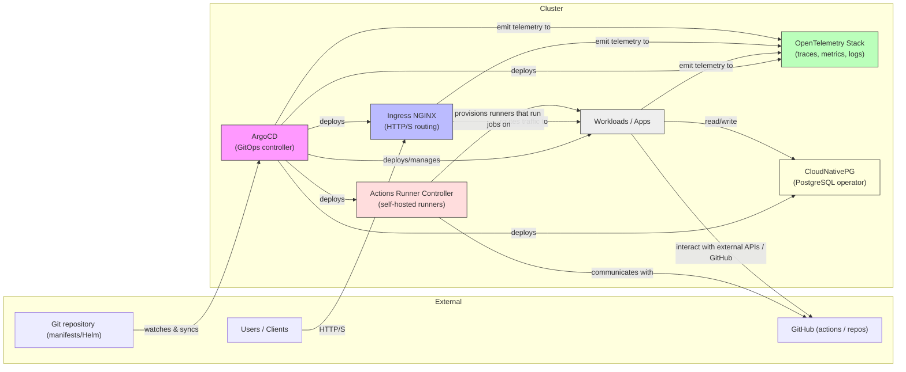

# Bernats Standard Kubernetes Services

This repository provides a curated set of standard Kubernetes services and infrastructure components for the Bernats organization, managed via Helm and ArgoCD. It is designed to bootstrap and maintain a production-grade Kubernetes environment with GitOps best practices.

## Overview

The core of this repository is a Helm chart (`bernats-standard-services`) that deploys and manages a suite of essential Kubernetes services using ArgoCD using an App of Apps pattern. The setup is modular, with each service having its own configuration and values files for customization.

## Included Services

The following core services are managed by this repository:

### Currently Running

- **ArgoCD**: GitOps continuous delivery controller for Kubernetes.
- **Ingress NGINX**: Ingress controller for HTTP(S) routing.
- **OpenTelemetry Stack**: Observability and tracing for workloads.
- **CloudNativePG**: PostgreSQL operator and managed database clusters.
- **Actions Runner Controller**: Self-hosted GitHub Actions runners.

### Disabled

- **Kube Prometheus Stack**: Monitoring and alerting (Prometheus, Grafana, Alertmanager).
- **Cert-Manager**: Automated certificate management.
- **Kyverno**: Kubernetes-native policy management.
- **Kubescape**: Kubernetes security and compliance.
- **Keycloak**: Identity and access management.
- **Headlamp**: Kubernetes web UI with plugins.

## Repository Structure

- `bernats-standard-services/Chart.yaml` – Helm chart definition.
- `bernats-standard-services/templates/` – ArgoCD Application manifests for each service.
- `bernats-standard-services/values/` – Service-specific Helm values files for customization.
- `services-kubernetes-01.yaml` – ArgoCD ApplicationSet or Application manifest to bootstrap all services.
- `bootstrap_argocd.sh` – Script to install ArgoCD and bootstrap the environment.

## Getting Started

### Prerequisites
- Kubernetes cluster (tested with recent versions)
- Helm
- kubectl

### Bootstrap Process
1. **Install ArgoCD** (if not already present):
	```bash
	./bootstrap_argocd.sh
	```
2. **Apply the main Application manifest**:
	```bash
	kubectl apply -f services-kubernetes-01.yaml -n argocd
	```
3. **ArgoCD will deploy and manage all standard services as defined in the chart.**

### Customization
- Edit the values in `bernats-standard-services/values/` to customize each service.
- Update `bernats-standard-services/values.yaml` for global settings (e.g., ingress hostname, repo URLs).

---
Maintained by the Bernats organization. Contributions and suggestions welcome!

**Services Interaction Diagram**

Below is a high-level diagram showing how the main running services interact inside the cluster and with external systems.


